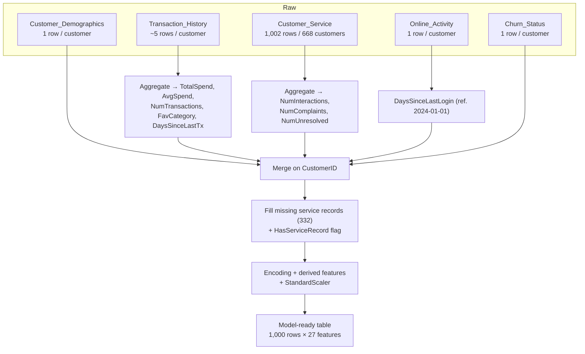

# Customer Churn Prediction — LBG Data Science & Analytics

End-to-end machine learning project that predicts **customer churn** identifying customers who are at risk of leaving from banking/customer data across demographics, transactions, service interactions, and online activity.


---

## Overview

**Problem.** Churned customers cost revenue, and the drivers of churn are rarely visible from a single metric. The goal is to identify customers likely to churn so that retention teams can act before losing them.

**Problem formulation.** Churn is framed as a **binary classification** task: each customer is labelled `1` (Churned) or `0` (Retained). The data is class-imbalanced (≈20% churn), so the pipeline treats imbalance explicitly via class weighting and SMOTE oversampling.

**Solution.** The repository walks the full ML lifecycle for this problem:

1. **Exploratory data analysis** (`notebooks/eda.ipynb`) — profiling, visualisations, and correlation analysis across five data sources.
2. **Data preparation** — aggregation, missing-value handling, outlier treatment, and encoding into a single model-ready table.
3. **Modelling** (`notebooks/machine_learning.ipynb`) — three candidate models (Logistic Regression, Random Forest, XGBoost) compared on a hold-out set, followed by Random Forest hyperparameter tuning.
4. **Interpretability** — feature importance and SHAP attributions for the final model.

The models are exploratory baselines rather than a production service: there is no deployed API or live inference endpoint in this repository.

## Features

- Multi-source data integration across 5 datasets (~5,000 transactions, 1,000 customers) merged on `CustomerID`.
- Imbalance handling via **SMOTE** and **class weighting** (`class_weight='balanced'`, `scale_pos_weight`).
- Benchmarking of **Logistic Regression**, **Random Forest**, and **XGBoost**.
- **RandomizedSearchCV** hyperparameter optimisation (RF: 305 trees, depth 9, min-samples-split 4) with 5-fold stratified cross-validation on ROC-AUC.
- Standard evaluation toolkit: classification report, confusion matrix, ROC-AUC, ROC/PR curves, 5-fold CV.
- Model explainability with **SHAP** values and ranked feature importance.
- Modular, config-driven scripted pipeline (`src/`) mirroring the notebook workflow.
- Full reporting artefacts: EDA and model reports (PDF/DOCX), EDA/feature/modelling visualisations.

## Tech Stack

| Category | Technologies |
| --- | --- |
| Programming language | Python |
| Machine learning | scikit-learn, XGBoost (gradient boosting) |
| Imbalance handling | imbalanced-learn (SMOTE) |
| Model explainability | SHAP |
| Data processing | pandas, numpy |
| Visualisation | matplotlib, seaborn |
| Configuration | PyYAML |
| File I/O | openpyxl (Excel read/write) |
| Notebook | Jupyter (`*.ipynb`) |

## Project Architecture

```mermaid
flowchart LR
    A["Customer_Churn_Data_Large.xlsx<br/>(5 sheets)"] --> B["Preprocessing<br/>Transaction & service aggregation<br/>DaysSinceLastLogin, merge, fill NA"]
    B --> C["Feature engineering<br/>Binary / ordinal / one-hot encoding<br/>SpendPerTx, ComplaintRate, IsHighRisk"]
    C --> D["StandardScaler"]
    D --> E["Train / test split<br/>80/20, stratified, seed 42"]
    E --> F["SMOTE on training set"]
    F --> G["Logistic Regression"]
    F --> H["Random Forest"]
    F --> I["XGBoost"]
    G --> J["Evaluation<br/>Precision / Recall / F1 / AUC-ROC"]
    H --> J
    I --> J
    J --> K["RandomizedSearchCV<br/>Random Forest tuning"]
    K --> L["Best Random Forest<br/>305 trees / depth 9 / split 4"]
    L --> M["SHAP & feature importance"]
    M --> N["model-ready table + artefacts<br/>(Churn_Model_Ready.xlsx)"]
```



**Data flow in detail**



## Project Structure

```text
lbg-data-science-and-analytics/
├── assets/
│   └── header_banner.png          # README banner image
├── case-study/                    # Lloyds Banking Group case-study tasks (PDF)
├── coc/                           # Certificate of completion (PDF)
├── configs/
│   └── config.yaml                # Centralised pipeline configuration
├── data/
│   ├── Customer_Churn_Data_Large.xlsx  # Raw workbook (5 sheets)
│   ├── Churn_Model_Ready.xlsx          # Engineered, model-ready table
│   ├── churn_status.csv                # Raw CSV equivalents of each sheet
│   ├── customer_demographics.csv
│   ├── customer_service.csv
│   ├── transaction_history.csv
│   ├── online_activity.csv
│   └── customer_churn_model_data.csv   # Transaction-level merged view
├── eda-phase/                     # EDA methodology & best-practice notes (MD)
├── ml-model-phase/                # Model selection & evaluation notes (MD)
├── notebooks/
│   ├── eda.ipynb                  # EDA + preprocessing + feature engineering
│   └── machine_learning.ipynb     # Model training, tuning, evaluation, SHAP
├── outputs/                       # Generated plots (EDA, confusion matrix,
│   │                              # feature importance, ROC/PR curves, SHAP)
├── report/                        # Churn analysis reports (PDF / DOCX)
├── src/
│   └── eda/
│       ├── __init__.py
│       ├── main.py                # CLI entry point (--eda / training)
│       ├── data_loader.py         # Reads Excel sheets via config
│       ├── eda.py                 # Stats + visualisation functions
│       ├── preprocessing.py       # Aggregation, merge, missing/outlier handling
│       ├── feature_engineering.py # Encoding, derived features, scaling
│       ├── model.py               # Model factory + pickle persistence
│       ├── train.py               # End-to-end training pipeline
│       ├── evaluate.py            # Classification report / confusion matrix
│       ├── utils.py               # Logging + YAML config helpers
│       └── machine_learning/      # Alternative SMOTE + RF/XGBoost pipeline
│           ├── main.py
│           ├── data_loader.py
│           ├── preprocessing.py   # Stratified split + SMOTE
│           ├── train.py           # RandomizedSearchCV + Random Forest
│           └── evaluate.py        # AUC-ROC, ROC/PR, SHAP plots
├── .gitattributes
├── .gitignore
├── CODE_OF_CONDUCT.md
├── CONTRIBUTING.md
├── LICENSE                        # MIT
├── README.md
└── requirement.txt                # Python dependencies
```

> **Note on the scripts vs. notebooks.** The verified results in this README come from `notebooks/`, which are self-contained and runnable. The `src/` modules codify the same workflow but are not fully wired to the current `configs/config.yaml` (see [Limitations](#limitations)).

## Dataset

The source is the Excel workbook `data/Customer_Churn_Data_Large.xlsx` (with per-sheet CSV copies in `data/`), representing 1,000 customers.

| Sheet / file | Rows | Purpose |
| --- | ---: | --- |
| `Customer_Demographics` | 1,000 | `CustomerID`, `Age`, `Gender` (M/F), `MaritalStatus` (Single/Married/Widowed/Divorced), `IncomeLevel` (Low/Medium/High) |
| `Transaction_History` | 5,054 | ~5 transactions per customer: `TransactionDate`, `AmountSpent`, `ProductCategory` (Electronics, Clothing, Furniture, Groceries, Books), `TransactionID` |
| `Customer_Service` | 1,002 | Service interactions for 668 customers: `InteractionType` (Inquiry, Feedback, Complaint), `ResolutionStatus` (Resolved/Unresolved) |
| `Online_Activity` | 1,000 | `LastLoginDate`, `LoginFrequency`, `ServiceUsage` (Mobile App, Website, Online Banking) |
| `Churn_Status` | 1,000 | Target: `ChurnStatus` — **204 churned (20.4%)**, 796 retained |

**Target distribution.** 79.6% retained vs. 20.4% churned — a moderately imbalanced classification problem.

**Note on `customer_churn_model_data.csv`.** A separate transaction-level merged view (20 columns, one row per transaction) also ships in `data/`; it is not the primary modelling table.

## Machine Learning Approach

### Problem formulation
Supervised binary classification: predict `ChurnStatus` ∈ {0, 1} from 27 engineered features. Imbalance is addressed explicitly because near-default thresholding on a 80/20 target biases the classifier toward the majority class.

### Preprocessing
- **Transaction aggregation** → `TotalSpend`, `AvgSpend`, `NumTransactions`, `FavCategory` (modal category), `DaysSinceLastTx` (days since most recent purchase).
- **Service aggregation** → `NumInteractions`, `NumComplaints`, `NumUnresolved`.
- **Online features** → `DaysSinceLastLogin` anchored to a `2024-01-01` reference date; `LoginFrequency` retained.
- **Merge** — all sheets left-joined on `CustomerID`; `Age` bucketed into `Young` (17–35), `Middle` (35–55), `Senior` (55–70).
- **Missing service records** — the 332 customers with no support interactions get a binary `HasServiceRecord` flag and zero-filled counts (absence of contact is treated as informative).
- **Outliers** — IQR-based detection reported per column; `AvgSpend` is winsorised at the 5th/95th percentiles into `AvgSpend_clean`, preserving raw values for audit.

### Feature engineering
- **Binary** encoding: `Gender` (M→1, F→0).
- **Ordinal** encoding: `IncomeLevel` (Low=0, Medium=1, High=2); `AgeGroup` (0/1/2).
- **One-hot** encoding (first dummy dropped): `MaritalStatus`, `ServiceUsage`, `FavCategory`.
- **Derived business features**: `SpendPerTx`, `ComplaintRate`, and `IsHighRisk` (flag for `LoginFrequency < 10` combined with ≥1 complaint).
- **Scaling**: `StandardScaler` applied to all numeric features except the target (persisted scaler supports future inference).
- Final modelling table: **1,000 rows × 27 features** (`data/Churn_Model_Ready.xlsx`).

### Why these models
- **Logistic Regression** — transparent baseline with interpretable coefficients.
- **Random Forest** — chosen because per-feature correlations with churn are all weak (`|r| < 0.1`, see EDA), so a non-linear ensemble that captures feature interactions was expected to outperform any single-variable reliance. Final model uses `class_weight='balanced'` plus SMOTE-resampled training data.
- **XGBoost** — gradient-boosted alternative benchmark using `scale_pos_weight = 796/204 ≈ 3.9` to counter imbalance.

### Training
- Stratified 80/20 train/test split (`random_state=42`), so each split preserves the 20% churn rate.
- SMOTE applied to the training fold only.
- **Hyperparameter tuning**: `RandomizedSearchCV` over Random Forest (`n_estimators` ∈ [100, 500], `max_depth` ∈ [3, 10], `min_samples_split` ∈ [2, 20]), 50 iterations, 5-fold stratified CV, scored on `roc_auc`. Best: **`n_estimators=305`, `max_depth=9`, `min_samples_split=4`**.

### Evaluation
Hold-out (200 customers): classification report, confusion matrix, ROC-AUC, ROC and precision-recall curves, plus 5-fold stratified CV AUC for the tuned model and SHAP/value-based feature importance.

> All results below are reproduced directly from `notebooks/machine_learning.ipynb` output.

## Model Performance

### Baseline comparison (hold-out, 200 customers, 41 churned / 159 retained)

| Model | Accuracy | AUC-ROC | Precision (Churned) | Recall (Churned) | F1 (Churned) |
| --- | ---: | ---: | ---: | ---: | ---: |
| Logistic Regression (SMOTE train) | 0.47 | 0.419 | 0.15 | 0.34 | 0.21 |
| Random Forest (balanced, 100 trees) | 0.77 | 0.502 | 0.33 | 0.12 | 0.18 |
| XGBoost (scale_pos_weight 3.9) | 0.58 | 0.506 | 0.21 | 0.39 | 0.28 |

### Tuned Random Forest (`n_estimators=305`, `max_depth=9`, `min_samples_split=4`)

| Metric | Value |
| --- | ---: |
| Accuracy | 0.76 |
| AUC-ROC (hold-out) | 0.471 |
| Precision / Recall / F1 (Churned) | 0.28 / 0.12 / 0.17 |
| 5-fold CV AUC (mean ± std) | **0.554 ± 0.079** |
| CV fold scores | 0.459, 0.514, 0.674, 0.508, 0.616 |

**Observations.** Retained-class performance is strong (≈93% recall), but churn detection is weak: churned-class recall ≈ 12–39% across models. The tuned Random Forest shows the best cross-validated AUC (0.554), yet all variants only modestly exceed random guessing — consistent with the EDA finding that **no single feature correlates strongly with churn**. Top-10 feature importances (RF): `DaysSinceLastLogin`, `LoginFrequency`, `TotalSpend`, `DaysSinceLastTx`, `Age`, `Income_enc`, `AgeGroup_enc`, `SpendPerTx`, `AvgSpend`, `AvgSpend_clean`. These figures should be understood as baselines, not production-ready performance.

## Installation

```bash
# 1. Clone
git clone https://github.com/charlesakinnurun/lbg-data-science-and-analytics.git
cd lbg-data-science-and-analytics

# 2. Create and activate a virtual environment
python -m venv .venv

# Windows
.venv\Scripts\activate
# macOS / Linux
# source .venv/bin/activate

# 3. Install dependencies
python -m pip install --upgrade pip
python -m pip install -r requirement.txt
```

Dependencies (`requirement.txt`): `pandas`, `numpy`, `scikit-learn`, `xgboost`, `imbalanced-learn`, `shap`, `matplotlib`, `pyyaml`, `openpyxl`.

## Usage

### Notebooks (recommended — reproduce the reported results)

Launch Jupyter and run the two notebooks in order:

```bash
jupyter notebook notebooks/eda.ipynb          # EDA → preprocessing → feature engineering
jupyter notebook notebooks/machine_learning.ipynb   # models → tuning → evaluation → SHAP
```

(Note: Jupyter is required to run notebooks but is not listed in `requirement.txt`.)

`eda.ipynb` ends by exporting `Churn_Model_Ready.xlsx`; `machine_learning.ipynb` loads it and trains/evaluates the models. Generated charts land under `outputs/` and `evaluation_curves.png`/`shap_summary.png` in the working directory (as written by `src/eda/machine_learning/evaluate.py`).

### Scripted pipelines (`src/`)

The modular pipeline mirrors the notebooks and is config-driven:

```bash
# Full training pipeline (data → preprocessing → features → train → evaluate → save)
python src/eda/main.py

# EDA only
python src/eda/main.py --eda

# Use a custom config
python src/eda/main.py --config configs/my_config.yaml
```

The alternative SMOTE + Random Forest/XGBoost scripted flow:

```bash
python src/eda/machine_learning/main.py
```

> **⚠️ Compatibility caveat.** These scripts are partially wired. The current `configs/config.yaml` does not yet contain the `data`, `preprocessing`, `encoding`, `features`, and `outlier_check` sections consumed by `src/eda/*`, and `src/eda/machine_learning/train.py` imports the unused package `jobpy` (not in `requirement.txt`). Expected outputs (model + scaler pickles) are written to `models/`. Until the wiring is completed, treat `notebooks/` as the runnable, reproducible path. See [Limitations](#limitations).

## Configuration

All pipeline settings are centralised in `configs/config.yaml`:

```yaml
project_name: "Churn Prediction"
random_state: 42
data_path: "data/Churn_Model_Ready.xlsx"
model_save_path: "models/best_rf_model.pkl"
test_size: 0.2

rf_params:
  n_estimators: 305
  max_depth: 9
  min_samples_split: 4
  class_weight: "balanced"

xgb_params:
  n_estimators: 100
  learning_rate: 0.1
  max_depth: 4
  eval_metric: "logloss"
  scale_pos_weight: 3.9          # 796 retained / 204 churned

n_iter_search: 50                # RandomizedSearchCV iterations
cv_folds: 5
```

| Setting | Used by | Notes |
| --- | --- | --- |
| `random_state`, `test_size` | Notebooks & `src/eda/machine_learning/` | Reproducibility seed / split size |
| `data_path`, `model_save_path` | `src/eda/machine_learning/` | Input workbook / save target for the tuned RF |
| `rf_params`, `xgb_params` | `src/eda/machine_learning/` | Model hyperparameters |
| `n_iter_search`, `cv_folds` | hyperparameter search | Tuning budget |

No environment variables are required; no secrets or credentials are used anywhere in the repository.

## Examples

- **Visualisation gallery** — `outputs/` contains the generated plots: EDA distributions (`visualizations.png`), correlation matrix (`feature_correlation.png`), confusion matrix (`confusion_matrix.png`), ROC & precision-recall curves (`roc_auc-precision-recall-curve.png`), top features (`feature_importance.png`), and SHAP summary (`shap.png`).
- **Case study** — `case-study/` holds the two Lloyds Banking Group task PDFs that frame this analysis.
- **Reports** — `report/` includes an EDA report, a model report, and a combined customer churn analysis report (`PDF`/`DOCX`).
- **Methodology notes** — `eda-phase/` and `ml-model-phase/` document the EDA best practices, model-selection reasoning, and evaluation techniques applied.

To reproduce any example, run the corresponding notebook (see [Usage](#usage)).

## Results

- A clean, **model-ready table of 1,000 customers × 27 features** was produced and exported (`data/Churn_Model_Ready.xlsx`).
- Churn is **not driven by any single feature**: all correlations with `ChurnStatus` are weak (`|r| < 0.1`), which motivated the ensemble approach.
- Of the three baselines, **Random Forest** and **XGBoost** are strongest on AUC-ROC (~0.50–0.51 on hold-out), with the tuned Random Forest reaching **mean 5-fold CV AUC 0.554 ± 0.079**.
- Retention (majority class) is predicted accurately (~93% recall), while **churned customers remain hard to detect** (recall ≈ 12–39%) — the key modelling gap this repository documents.

## Deployment

No deployment configuration is present in the repository. There are no Dockerfiles, CI/CD workflows, cloud services, or API/UI applications — the project currently ships as analysis notebooks plus scripts, with persistence limited to local pickled model files. (Deployment is listed as a priority under [Future Improvements](#future-improvements).)

## Testing

No automated tests are present in this repository (no `tests/`, `pytest`/`unittest`, or CI configuration). Validation is performed manually through the notebooks' hold-out evaluation and 5-fold cross-validation.

## Limitations

- **Modest predictive power.** With all target correlations `|r| < 0.1` and hold-out AUC-ROC of 0.42–0.51, the current feature set does not yet separate churners reliably. Results are honest baselines, not production-grade.
- **Script/module wiring is incomplete.** `src/eda/*` expects config sections (`data.*`, `preprocessing.*`, `encoding.*`, `features.*`, `outlier_check.*`) that are absent from the committed `configs/config.yaml`, and imports (`from src.utils import …`) reference a package layout the repo does not have.
- **Unused/broken import.** `src/eda/machine_learning/train.py` imports `jobpy`, which is not in `requirement.txt` and is not used; running this module as-is raises `ModuleNotFoundError`.
- **No persisted final model or inference path.** No pickled model, scorer, prediction script, or serving layer is included.
- **No tests or CI**, and no monitoring/retraining strategy.
- **Dependency file naming** — the requirements file is `requirement.txt` (singular), which is easy to miss.

## Future Improvements

- **Complete the scripted pipeline wiring**: align `configs/config.yaml` with the schema consumed by `src/eda/*`, fix the `jobpy` import and package imports, and run the training end-to-end to reproduce notebook metrics from the CLI.
- **Persist and serve the model**: save the tuned Random Forest + scaler (target already declared as `models/best_rf_model.pkl`) and add an inference script or lightweight API (e.g., FastAPI) with a prediction endpoint.
- **Improve churn recall**: threshold tuning against a cost matrix, feature selection/interaction terms, alternative resampling (e.g., ADASYN, Tomek links), and stronger learners such as tuned XGBoost or LightGBM with Bayesian optimisation.
- **Data quality & features**: obtain richer behavioural signals (account balances, channel spend per category, recency/frequency/monetary temporal features) as several columns show weak discriminative power.
- **Evaluation rigour**: calibrate probabilities, add bootstrap confidence intervals, and track AUC/precision-recall by business segment.
- **MLOps**: Docker image, CI pipeline with linting + tests, model versioning, drift detection, and a scheduled retraining job.

## License

This project is licensed under the [MIT License](LICENSE).

## Author

**Charles Akinnurun** — built as part of the Lloyds Banking Group data science and analytics programme (see `case-study/` and `coc/`).

Contributions are welcome — see [CONTRIBUTING.md](CONTRIBUTING.md) and the [Code of Conduct](CODE_OF_CONDUCT.md).